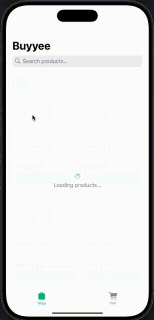
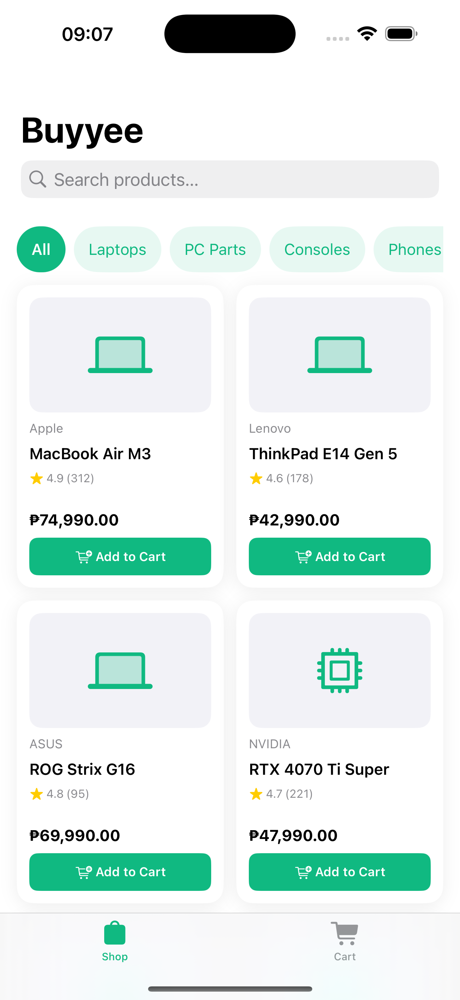
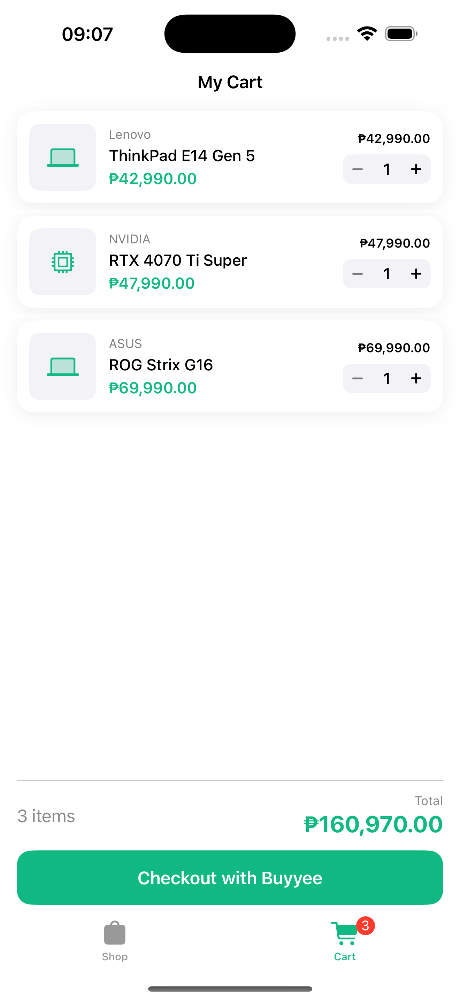

# Buyyee — iOS Demo App

A demo gadget marketplace with **Buy Now, Pay Later (BNPL)** and debit card payments. Built as a portfolio project demonstrating production-quality iOS architecture, fintech-grade financial precision, and security best practices.

---

## Demo

<p align="center">
  
</p>

> Browse gadgets → Add to cart → Choose installment plan → Confirm payment → View receipt

---

## Screenshots

<p align="center">
  
  
  
</p>

---

## Tech Stack

| Category | Choice | Reason |
|---|---|---|
| **Language** | Swift 5.9 | Latest stable, strict concurrency |
| **UI Framework** | SwiftUI | Declarative, iOS 15+ compatible |
| **Minimum OS** | iOS 17.0 | Structured concurrency, Swift Charts |
| **Architecture** | Clean Architecture + MVVM-C | Separation of concerns, testability |
| **State Management** | Combine + `@Published` | Native reactive framework |
| **Concurrency** | Swift `async/await` + `@MainActor` | Thread-safe UI updates |
| **Currency** | `Decimal` | Base-10 precision for financial math |
| **Security** | `Keychain` + `LAContext` + SSL Pinning | Production fintech standards |
| **Dependencies** | **Zero** third-party libraries | No supply chain risk |

---

## Architecture

### Overview

```
Buyyee/
├── App/
│   ├── BuyyeeApp.swift           # @main entry point + DependencyContainer
│   └── AppCoordinator.swift      # Navigation state machine (MVVM-C coordinator)
│
├── Core/                         # Zero UI dependencies — pure business logic
│   ├── Models.swift              # Domain types (Product, Cart, Transaction, User)
│   ├── Protocols.swift           # Interfaces for DI (NetworkService, Keychain, Biometric)
│   ├── AppErrors.swift           # Typed error hierarchy (NetworkError, PaymentError)
│   ├── BNPLCalculator.swift      # Amortization engine (Decimal precision)
│   └── SecurityServices.swift    # Keychain, BiometricService, SSL pinning delegate
│
├── Data/                         # Data access layer
│   ├── MockAPIService.swift      # Simulates network (800ms delay, error injection)
│   ├── MockData.swift            # 15 products, 1 user, 6 transactions
│   └── Repositories.swift        # ProductRepository, CartRepository, TransactionRepository
│
├── Features/                     # One file per screen feature
│   ├── ProductListFeature.swift  # Shop tab (grid, search, filter, shimmer)
│   ├── CartFeature.swift         # Cart tab (quantity stepper, swipe-to-delete)
│   ├── CheckoutFeature.swift     # Checkout modal (5-step state machine)
│   └── TransactionHistoryFeature.swift  # History tab (pagination, offline fallback)
│
├── DesignSystem/
│   └── Components.swift          # Reusable components (FilterChip, LoadingButton, etc.)
│
└── BuyyeeTests/
    ├── BNPLCalculatorTests.swift         # 20+ unit tests for amortization logic
    └── ProductListViewModelTests.swift   # ViewModel state transition tests
```

### Layer Responsibilities

```
┌─────────────────────────────────────────┐
│           Features (UI Layer)           │  SwiftUI Views + @MainActor ViewModels
│  ProductList · Cart · Checkout · History│  No business logic, no direct data access
├─────────────────────────────────────────┤
│         Repositories (Data Layer)       │  Cache management, offline fallback
│  ProductRepo · CartRepo · TransactionRepo│  Depend on Protocols, not concretions
├─────────────────────────────────────────┤
│           Core (Domain Layer)           │  Pure Swift — no UIKit, no SwiftUI
│  Models · Protocols · BNPLCalculator    │  Framework-independent, fully testable
├─────────────────────────────────────────┤
│          Data Sources (Infra)           │  MockAPIService (swappable for real API)
│  MockAPIService · SecurityServices      │  Implements Core protocols
└─────────────────────────────────────────┘
```

---

## Running the Project

### Requirements
- Xcode 15.0+
- iOS 17.0+ Simulator or device
- No additional dependencies — zero third-party packages

### Steps
1. Open `Buyyee.xcodeproj`
2. Select any iOS 17+ simulator
3. Press `⌘R`

### Biometric Auth on Simulator
Face ID is disabled by default on simulators:
1. In the running simulator: **Features → Face ID → Enrolled**
2. When the auth prompt appears: **Features → Face ID → Matching Face**

### Running Tests
```
⌘U  →  Runs BNPLCalculatorTests (20+ cases) + ProductListViewModelTests
```

---

## Mock Data

The app runs entirely on mock data — no backend required.

| Data | Details |
|---|---|
| **Products** | 15 items across 5 categories, realistic Philippine pricing |
| **User** | Juan dela Cruz, KYC verified, ₱120,000 available credit |
| **Transactions** | 6 sample orders (Approved, Pending, Declined, Refunded, Cancelled) |
| **Network delay** | 800ms simulated latency |
| **Error injection** | Set `MockAPIService.shouldFail = true` to test error states |

---

## What's Next (Roadmap)

- [ ] **Product detail screen** — full specs, image gallery, stock indicator
- [ ] **CoreData persistence** — cart and transaction history survive app kill
- [ ] **Real API integration** — swap `MockAPIService` for `URLSession`-backed service
- [ ] **Accessibility** — VoiceOver labels, Dynamic Type, minimum contrast audit
- [ ] **Dark mode** — semantic color tokens already in place
- [ ] **Push notifications** — payment reminders via APNs
- [ ] **Jailbreak detection** — production fintech requirement

---
